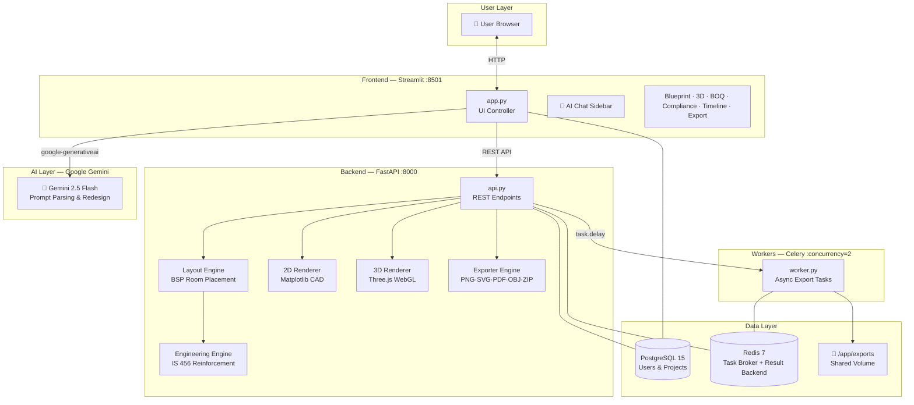

<div align="center">

# 🏗️ BuildMetrics AI
### AI-Powered Architectural Blueprint Generator

[](https://www.python.org)
[](https://streamlit.io)
[](https://fastapi.tiangolo.com)
[](https://threejs.org)
[](https://postgresql.org)
[](https://redis.io)
[](https://docs.celeryq.dev)
[](https://docker.com)
[](LICENSE)
[](https://github.com)

*Transform a single text prompt into a fully-engineered, production-grade architectural blueprint in seconds.*

[Quick Start](#-quick-start) · [Features](#-features) · [Architecture](#-system-architecture) · [API Docs](#-api-endpoints) · [Configuration](#-environment-variables) · [Contributing](#-contributing)

</div>

---

## ✨ Features

BuildMetrics AI is a complete AI-driven architectural design and analysis platform, combining Gemini AI, procedural layout generation, structural engineering calculations, and interactive 3D visualization into a single cohesive application.

| Category | Capabilities |
|---|---|
| **AI Design** | Natural language → full floor plan (Gemini 2.5 Flash), interactive AI chat redesign, diff-view change tracking |
| **2D Blueprints** | CAD-quality floor plan drawings with 12 toggleable layers (axes, hatches, dimensions, compass, title block) |
| **3D Visualization** | Interactive Three.js WebGL viewer with 4 render modes (Blueprint, Shaded, Rebar, Wireframe), walkthrough camera, sun-path lighting |
| **Structural Engineering** | IS 456 / ACI 318 column & beam reinforcement schedules, slab rebar mesh grids, compliance annotations |
| **Cost Estimation (BOQ)** | Bill of Quantities with material takeoffs (concrete m³, steel kg, brickwork, mortar), per-room cost breakdown |
| **Architecture Styles** | 12 styles: Modern, Classic, Industrial, Brutalist, Luxury Villa, Contemporary, Craftsman, Japandi, Scandinavian, Tropical, Mediterranean, Minimalist |
| **Exports** | PNG · SVG · PDF · OBJ · GLTF · HTML (standalone 3D) · ZIP bundle (all formats) |
| **User Management** | JWT-less session auth with bcrypt password hashing, 5-strike account lockout, project save/load |
| **Compliance Checking** | NBC India 2016 habitable area, egress width, stair geometry validation with color-coded annotations |

---

## ⚡ Quick Start

> **Prerequisites**: Docker and Docker Compose installed. A [Gemini API key](https://aistudio.google.com/app/apikey).

```bash
# 1. Clone the repository
git clone https://github.com/your-org/buildmetrics-ai.git
cd buildmetrics-ai

# 2. Configure environment
cp .env.example .env
# Edit .env and set your GEMINI_API_KEY

# 3. Launch all services
docker compose up --build

# 4. Open the application
#    Streamlit UI: http://localhost:8501
#    FastAPI Docs: http://localhost:8000/docs
```

That's it. The stack auto-runs Alembic migrations, starts the Celery worker, and has the UI ready in under 60 seconds.

### Local Bare-Metal Development

```bash
# Install dependencies
pip install -r requirements.txt

# Set env vars
export GEMINI_API_KEY=your_key_here
export DATABASE_URL=sqlite:///buildmetrics.db
export API_BASE_URL=http://localhost:8000

# Terminal 1 — FastAPI backend
uvicorn api:app --host 0.0.0.0 --port 8000 --reload

# Terminal 2 — Streamlit frontend
streamlit run app.py --server.port 8501

# Terminal 3 — Celery worker (optional, needed for async exports)
celery -A worker.celery_app worker --loglevel=info
```

---

## 🏛️ System Architecture



---

## 🗂️ Project Structure

```
buildmetrics-ai/
├── app.py                  # Streamlit frontend UI controller
├── api.py                  # FastAPI REST backend
├── db.py                   # SQLAlchemy ORM models & user repository
├── worker.py               # Celery async task worker
├── cost_engine.py          # ML-based cost prediction (joblib)
├── civil_math.py           # Structural quantity calculation helpers
│
├── build_matrix/           # Core engine package
│   ├── models.py           # Pydantic data models (BuildingModel, RoomSpec, etc.)
│   ├── schemas.py          # FastAPI request/response schemas
│   ├── layout_engine.py    # Procedural BSP floor plan generator (1,084 lines)
│   ├── engineering.py      # IS 456 / ACI 318 structural calculations (288 lines)
│   ├── drawing_2d.py       # Matplotlib 2D CAD blueprint renderer
│   ├── rendering_3d.py     # Three.js WebGL 3D scene generator (1,260+ lines)
│   ├── exporter.py         # Multi-format export engine
│   ├── input_handler.py    # Gemini prompt parser & NLP extractor
│   └── labeling.py         # Room label and annotation manager
│
├── tests/
│   ├── test_api.py         # FastAPI integration tests (15 test cases)
│   └── test_db.py          # Database repository tests (7 test cases)
│
├── alembic/                # Database migration scripts
│   └── versions/           # Version-controlled schema migrations
│
├── docs/
│   └── ASSUMPTIONS.md      # Engineering assumptions and safety factors
│
├── Dockerfile              # Multi-stage Docker build (builder + runner)
├── docker-compose.yml      # 5-service orchestration (db, redis, api, app, worker)
├── requirements.txt        # Pinned production dependencies
├── .env.example            # Environment variable reference
├── .github/workflows/ci.yml # GitHub Actions CI pipeline
├── PLAN.md                 # Engineering roadmap and phase tracker
└── README.md               # This file
```

---

## 🔌 API Endpoints

All endpoints are documented interactively at `http://localhost:8000/docs` (Swagger UI).

### Core Endpoints

| Method | Endpoint | Description |
|--------|----------|-------------|
| `GET` | `/healthz` | Liveness probe for Docker/K8s health checks |
| `POST` | `/api/v1/generate` | Generate building model from prompt |
| `POST` | `/api/v1/render/2d` | Render 2D CAD blueprint PNG |
| `POST` | `/api/v1/render/3d` | Render interactive Three.js 3D HTML viewer |
| `POST` | `/api/v1/export` | Synchronous file export (PNG/SVG/PDF/OBJ/GLTF/HTML/bundle) |
| `POST` | `/api/v1/export/async` | Queue async Celery export task |
| `GET` | `/api/v1/export/status/{task_id}` | Poll async task status |
| `GET` | `/api/v1/download` | Serve a completed export file |

### Example: Generate a Building

```bash
curl -X POST http://localhost:8000/api/v1/generate \
  -H "Content-Type: application/json" \
  -d '{
    "prompt": "4-bedroom modern villa with garage and garden",
    "plot_length": 30.0,
    "plot_width": 20.0,
    "max_height": 12.0,
    "num_floors": 3,
    "style": "Modern"
  }'
```

```json
{
  "building_id": "a1b2c3d4-...",
  "model": {
    "style": "Modern",
    "plot": { "length": 30.0, "width": 20.0, ... },
    "rooms": [...],
    "boq_estimate": { "cost_usd": 248500, ... }
  }
}
```

---

## ⚙️ Environment Variables

| Variable | Default | Required | Description |
|----------|---------|----------|-------------|
| `GEMINI_API_KEY` | — | ✅ Yes | Google AI Studio API key for Gemini |
| `DATABASE_URL` | `sqlite:///buildmetrics.db` | No | PostgreSQL or SQLite connection string |
| `API_BASE_URL` | `http://localhost:8000` | No | FastAPI base URL (used by Streamlit) |
| `REDIS_URL` | `redis://localhost:6379/0` | No | Redis URL (needed for async Celery exports) |
| `ALLOWED_ORIGINS` | `*` | No | Comma-separated CORS origins (use your domain in prod) |
| `ENVIRONMENT` | `development` | No | Environment tag: `development` / `staging` / `production` |
| `SENTRY_DSN` | — | No | Sentry DSN for error tracking |
| `SHARED_EXPORT_DIR` | `/app/exports` | No | Shared volume path for export files |

---

## 🔧 Technical Stack

### Core Framework
- **[Streamlit 1.63](https://streamlit.io)** — Interactive frontend with reactive session state
- **[FastAPI 0.141](https://fastapi.tiangolo.com)** — High-performance REST API with OpenAPI auto-docs
- **[Celery 5](https://docs.celeryq.dev)** + **[Redis 7](https://redis.io)** — Distributed async export task queue

### Data & Storage
- **[PostgreSQL 15](https://postgresql.org)** + **[SQLAlchemy 2](https://sqlalchemy.org)** — ORM with connection pooling
- **[Alembic](https://alembic.sqlalchemy.org)** — Version-controlled database migrations
- **[Pydantic 2](https://docs.pydantic.dev)** — Runtime type validation, serialization, and schema generation

### AI & Compute
- **[Google Gemini 2.5 Flash](https://ai.google.dev)** — Natural language architectural prompt parsing and redesign
- **[Trimesh](https://trimsh.org)** — 3D mesh construction, boolean operations, OBJ/GLTF export
- **[Matplotlib](https://matplotlib.org)** — CAD-quality 2D blueprint drawing engine
- **[NumPy](https://numpy.org)** — Geometric calculations and vector operations

### 3D Visualization
- **[Three.js r128](https://threejs.org)** — WebGL 3D scene rendering (embedded in generated HTML)
- **OrbitControls** — Mouse-driven orbit, pan, and zoom
- **PointerLockControls** — First-person walkthrough camera (WASD + mouse look)
- **PBR Materials** — MeshStandardMaterial with normal maps, ACES filmic tone mapping

### Security & Observability
- **[bcrypt](https://pypi.org/project/bcrypt)** — Password hashing with account lockout (5-strike policy)
- **[Sentry SDK](https://sentry.io)** — Error tracking and performance monitoring
- **[python-json-logger](https://pypi.org/project/python-json-logger)** — Structured JSON logging for API

---

## 🧪 Running Tests

```bash
# Run all tests with coverage
pytest tests/ -v --tb=short --cov=build_matrix --cov=api --cov=db

# Run specific test file
pytest tests/test_api.py -v

# Run with specific env
GEMINI_API_KEY=dummy pytest tests/
```

---

## 🚀 Production Deployment

### Docker Compose (Recommended)

```bash
# Build and start all 5 services
docker compose up --build -d

# Check service health
docker compose ps

# View logs
docker compose logs -f api

# Apply DB migrations (auto-runs on startup)
docker compose exec api alembic upgrade head
```

### Services Started by Docker Compose

| Service | Port | Description |
|---------|------|-------------|
| `db` | 5432 | PostgreSQL 15 (persistent data volume) |
| `redis` | 6379 | Redis 7 (Celery broker + result backend) |
| `api` | 8000 | FastAPI REST backend |
| `app` | 8501 | Streamlit frontend |
| `worker` | — | Celery async worker (2 concurrent tasks) |

### Production Checklist

- [ ] Set `ALLOWED_ORIGINS` to your actual domain(s) (not `*`)
- [ ] Set `ENVIRONMENT=production`
- [ ] Set `SENTRY_DSN` for error tracking
- [ ] Use a strong `POSTGRES_PASSWORD` (change from default)
- [ ] Set up HTTPS reverse proxy (nginx/Caddy) in front of ports 8000 and 8501
- [ ] Configure a cronjob or Kubernetes CronJob to evict old `exports/` files

---

## 📐 Engineering Assumptions

The structural calculations are based on the following standards:

- **Building Code**: NBC India 2016 with IS 456:2000 reinforcement guidelines
- **Concrete Grade**: M20/M25 for general residential construction
- **Slab Thickness**: 150mm default for residential loading
- **Steel Ratio**: 1.5% of concrete volume (~115-120 kg/m³)
- **Live Loads**: 2 kN/m² (40 psf) standard residential

> ⚠️ **Wind and seismic loads are NOT factored into current calculations.** High-rise projects (>4 floors) will underestimate shear wall requirements. See [`docs/ASSUMPTIONS.md`](docs/ASSUMPTIONS.md) for full details.

---

## ⚠️ Known Limitations

| Area | Limitation |
|------|------------|
| Structural | Wind/seismic load not modeled — outputs are conceptual estimates |
| Cost | Static 2025/2026 material price indices; does not poll live commodity prices |
| Currency | Static conversion rates: 1 USD = 83 INR, 1 USD = 0.92 EUR |
| 3D Viewer | PointerLockControls require user gesture (click) before walkthrough activates |
| ML Cost Model | Requires `cost_model.pkl` to be pre-trained; not included in repo |
| Auth | Session-based (no JWT); not suitable for multi-instance horizontal scaling without Redis session storage |

---

## 🛣️ Roadmap

| Phase | Status | Description |
|-------|--------|-------------|
| Phase 1 — Core Models | ✅ Complete | Pydantic building model, plot geometry, room specs |
| Phase 2 — Layout Engine | ✅ Complete | BSP tree procedural floor plan generation |
| Phase 3 — 2D Drawing | ✅ Complete | Matplotlib CAD rendering with 12 layers |
| Phase 4 — Engineering | ✅ Complete | IS 456 structural schedules, compliance checker |
| Phase 5 — Gemini AI | ✅ Complete | Prompt parsing, AI chat redesign, diff view |
| Phase 6 — Auth & DB | ✅ Complete | bcrypt auth, PostgreSQL, Alembic migrations |
| Phase 7 — FastAPI | ✅ Complete | REST API, CORS, Sentry, structured logging |
| Phase 8 — Exports | ✅ Complete | PNG, SVG, PDF, OBJ, GLTF, HTML, ZIP bundle |
| Phase 9 — 3D Studio | ✅ Complete | Three.js PBR rendering, walkthrough camera |
| Phase 10 — Production | ✅ Complete | Docker Compose, CI/CD, healthchecks |
| Phase 11 — Live Deploy | 🔜 Planned | HTTPS, Streamlit Cloud / GCP Cloud Run |
| Phase 12 — Metrics | 🔜 Planned | Prometheus + Grafana observability dashboard |

---

## 🤝 Contributing

Contributions, issues and feature requests are welcome!

1. **Fork** the repository
2. Create your branch: `git checkout -b feature/amazing-feature`
3. Commit your changes: `git commit -m 'feat: Add amazing feature'`
4. Push to branch: `git push origin feature/amazing-feature`
5. Open a **Pull Request** targeting `main`

Please run `ruff check .` and `pytest tests/` before submitting a PR. The CI pipeline will automatically reject PRs with lint errors or failing tests.

---

## 📋 Changelog

### v1.0.0 — Production Release (September 2026)
- ✅ Fixed critical `\\n` literal bug in AI chat context and diff messages
- ✅ Fixed `cost_engine.py` Streamlit dependency (crashed API/worker)
- ✅ Fixed `api.py` top-level Celery import (crashed API without Redis)
- ✅ Fixed `docker-compose.yml` malformed YAML command string
- ✅ Added `curl` to Dockerfile runner stage (healthcheck support)
- ✅ Added `/healthz` endpoint to FastAPI
- ✅ Fixed cache key unhashable dict bug in `fetch_2d_image_cached`
- ✅ Added 30-second timeout guard + sync fallback to all export polling loops
- ✅ Implemented Phase 9 walkthrough camera (PointerLockControls + WASD)
- ✅ Fixed Three.js `controls` scoping bug (was `const` inside `init()`)
- ✅ CORS now configurable via `ALLOWED_ORIGINS` env var
- ✅ Comprehensive test suite: 22 test cases across API + DB layers
- ✅ CI strengthened: Ruff fail-fast, coverage floor, Docker smoke test

---

## ⚖️ Legal Disclaimer

All outputs generated by BuildMetrics AI — including floor plans, structural schedules, and Bill of Quantities — are **AI-generated preliminary estimates for conceptual evaluation only**.

They **must** be reviewed, validated, and formally stamped by a **licensed structural engineer or registered architect** before use in any construction, permitting, procurement, or regulatory submission.

BuildMetrics AI and its contributors assume **no liability** for structural integrity, code compliance, or any consequences arising from the use of these outputs.

---

<div align="center">

**Built with 🏗️ by the BuildMetrics AI Team**

*Powered by Google Gemini · Three.js · FastAPI · Streamlit*

</div>
